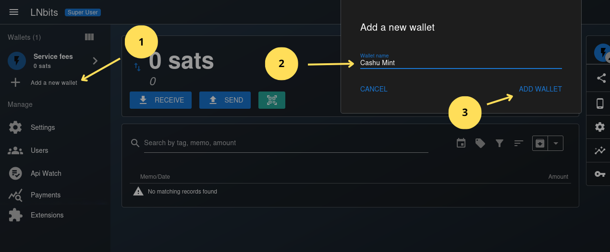
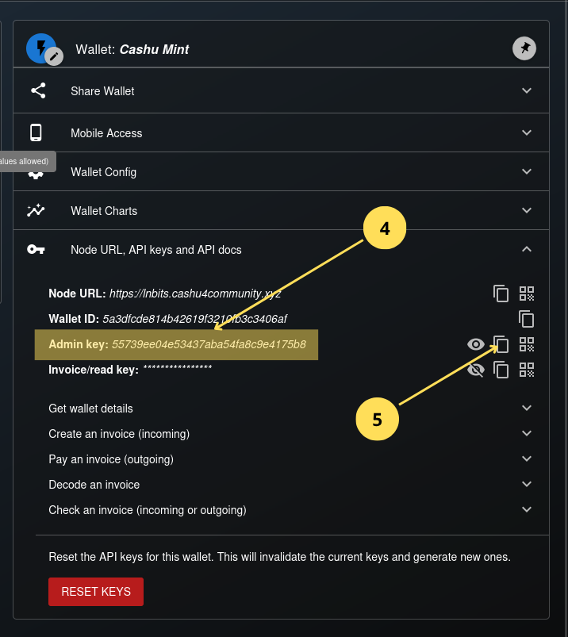
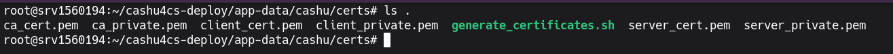
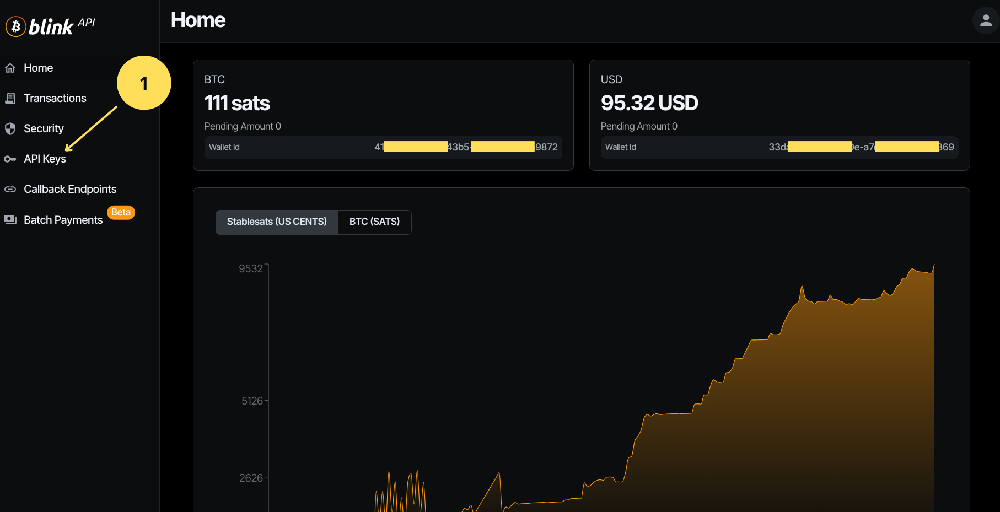
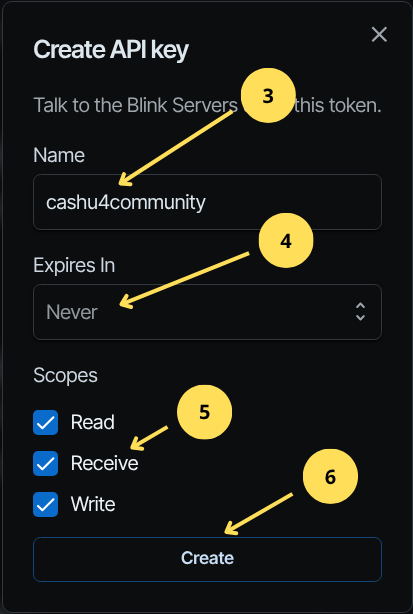

## 6 Mint de Cashu (Nutshell)

El Mint de cashu es el componente principal de la infraestructura de cashu, es quien custodia los bitcoins de los usuarios, a cambio emite tokens ("cupones digitales") que representan ese valor. Conociendo esto explicaremos el proceso de configuración paso a paso.

### 6.1 Configurando el backend lightning (LNbits).

A continuación, configuraremos una nueva billetera en LNbits que actuará como depósito principal de los fondos de los usuarios del Mint. Esta billetera será la encargada de recibir los sats cuando un usuario quiera depositar fondos en el Mint, y también de enviar los sats cuando un usuario quiera retirarlos.

Vamos a la cuenta creada en el tutorial de LNbits, iniciamos sesión y creamos la billetera la siguiente imagen muestra el proceso.

*Imagen 1: Creación de billetera para depósitos del Mint.*



1. Hacemos clic en `Add a new wallet`.
2. Nos aparece una ventana donde introducimos el nombre de la billetera, ponemos Cashu Mint, puede ser cualquier nombre lo importante es que sepan para que es esa billetera.
3. Adicionamos la billetera.

Después de creada necesitamos obtener la clave api que nos permitirá recibir pagos y pagar facturas.

De la misma manera que fuimos en el tutorial anterior (LNbits) a buscar el id de billetera para las comisiones por transacción, buscamos la clave de `Admin key` 

*Imagen 2: Clave `Admin key` para realizar y recibir pagos en el Mint de Cashu.*



4. Seleccionamos la llave `Admin key`.
5. Copiamos la llave.

Ahora en la terminal nos desplazamos al directorio `app-data/cashu/`

```bash
cd app-data/cashu
``` 

Editamos el archivo `.env` 

```bash
nano .env
```

Luego buscamos los siguientes parámetros:

```text
# Use with LNbitsWallet
MINT_LNBITS_ENDPOINT=https://yourlnbits.com
MINT_LNBITS_KEY=gds87dskdsjhds71dsdsdsds2e
```

Donde dice `https://yourlnbits.com` ponemos `https://lnbits.cashu4community.xyz` y donde dice `MINT_LNBITS_KEY` sustituimos `gds87dskdsjhds71dsdsdsds2e` por la clave que copiamos anteriormente `55739ee04e53437aba54fa8c9e4175b8`. Quedando de la siguiente manera:

```text
# Use with LNbitsWallet
MINT_LNBITS_ENDPOINT=https://lnbits.cashu4community.xyz
MINT_LNBITS_KEY=55739ee04e53437aba54fa8c9e4175b8
```

Salvamos y salimos del archivo `ctrl+s` y `ctrl+x`

Reiniciamos el contenedor `docker-compose restart cashu` y se aplican los cambios.

### 6.2 Generando los certificados RPC.

Los certificados ssl son necesarios para poder conectarno via RPC al Mint y ejecutar comandos remotos, útil si se quiere usar Orchard para administrar el Mint. Para generarlos nos trasladamos al directorio `certs` de la siguiente manera:

```bash
cd app-data/cashu/certs
```

ejecutamos el script `generate_certificates.sh` de la siguiente manera:

```bash
./generate_certificates.sh
```

este script generará todos los certificados necesarios, podemos comprobar ejecutan el siguiente comando:

```bash
ls .
```

*Imagen 3: Listado de archivos dentro del directorio certs.*



Tras realizar estos cambios reiniciamos el contenedor docker

```bash
docker-compose restart cashu
```

### 6.3 Creando un nuevo keysets desde la CLI.

Usaremos mint-cli para rotar los keyset y definir la comisión. Esto lo haremos para cada una de las unidades que tengamos en el mint ya sea sats, usd.

Para conocer que unidades tenemos activas en el Mint de cashu, consultamos el endpoint /v1/keysets, lo haremos de la siguiente manera, esto se puede hacer también desde un navegador con solo introducir la url:

```bash
curl https://mint.cashu4community.xyz/v1/keysets
```

El comando curl nos devuelve lo siguiente:

```json
{
  "keysets": [
    {
      "id": "0145ee812683eaf8ce3859f2601c160d0c8f0d4139447848d0d6745350f3c4fb44",
      "unit": "sat",
      "active": true,
      "input_fee_ppk": 100,
      "final_expiry": null
    }
  ]
}
```


Lo anterior nos indica que existe un keysets cuya unidad es el sat, que se encuentra activo, con un input_fee_ppk de 100 y que no expira.

Ej: si quisiéramos cambiar el fee de 100 ppk (per-proof-of-knowledge) por sat (Bitcoin) a 50 ppk, ejecutaríamos lo siguiente dentro del contenedor de cashu:

```bash
docker exec -it app_cashu bash
```
ya dentro del contenedor ejecutamos:

```bash
poetry run mint-cli -h cashu next-keyset sat 50
```

>**Nota**: El argumento -h que acompaña al comando mint-cli es necesario porque en un entornos docker no se puede acceder directamente a 127.0.0.1, es por eso que usamos cashu ya que es el nombre del servicio declarado en el docker compose. 

lo que nos devolvería algo como esto:

```text
final_expiry = None
New keyset successfully created:
keyset.id = '01e5bac64190f22f2959558b15cbab9f06798958f253a59fbe4687a9d875e3c720'
keyset.unit = 'sat'
keyset.max_order = 64
keyset.input_fee_ppk = 50
0
```

Si ahora ejecutamos nuevamente el comando:

```bash
curl https://mint.cashu4community.xyz/v1/keysets
```

Nos devuelve el par de keysets el antiguo y el nuevo.

```json
{
  "keysets": [
    {
      "id": "0145ee812683eaf8ce3859f2601c160d0c8f0d4139447848d0d6745350f3c4fb44",
      "unit": "sat",
      "active": false,
      "input_fee_ppk": 100,
      "final_expiry": null
    }
	{
      "id": "01e5bac64190f22f2959558b15cbab9f06798958f253a59fbe4687a9d875e3c720",
      "unit": "sat",
      "active": true,
      "input_fee_ppk": 50,
      "final_expiry": null
    }
  ]
}
```

### 6.4 Soporte de estable usd con Blink en el Mint.

En la versión 0.20.0 de nutshell se añadió soporte para USD mediante Blink como fuente de fondeo. En los siguientes pasos explicaremos que deben realizar tanto en blink como en el Mint de cashu.

Como requisito se debe tener una cuenta en la billetera lightning Blink de lo contrario no podremos continuar, así que, si no tiene una cuenta descargue la aplicación para Android desde la Google Play Store [aquí](https://play.google.com/store/apps/details?id=com.galoyapp) si es un dispositivo IOS puede descargarla desde la App Store [aquí](https://apps.apple.com/ng/app/blink-bitcoin-wallet/id1531383905). Teniendo ya el registro de la billetera aacedemos a `https://dashboard.blink.sv`

Tras iniciar sesión nos aparece el panel de administración de la cuenta donde se ven las dos billeteras que tenemos una en sats y la otra en usd y varias opciones más, la que nos interesa es la de API Keys.

*Imagen 3: Panel de administración de Blink - API Keys.*

 

1. Luego de seleccionar `API Keys` en el menú de opciones no aparece lo siguiente pantalla donde podremos crear una nueva clave de la API.

*Imagen 4: Creando nueva clave de la API.*


2. Hacemos clic en el botón con el símbolo +

Nos aparece una ventana donde introduciremos un nombre para identificar el uso de la llave, el tiempo de vida de la clave API y las operaciones que permitiremos hacer con ella. 

*Imagen 5: Parámetros de la clave API.*



3. Introducimos el nombre de la clave API, algo que sugiera el uso que se le va a dar.
4. Tiempo de expiración de la clave seleccionamos `Never`.
5. En las operaciones que se podran hacer con la API las seleccionamos todas.
6. Hacemos clic en el botón `Create` para crear la clave.

Luego de crear la clave nos aparece por única vez una ventana donde podemos copiar las claves de la api, se recomienda respaldarlas en un lugar seguro. Para nuestro caso solo nos interesa la relacionada con USD; pero en caso de que quieran usar Blink como cuenta de fondeo para el mint tanto en USD como en BTC 

*Imagen 6: Claves API para conectarse a las cuentas BTC y USD de Blink.*


7. Copiamos la clave en un lugar seguro (esta será la que usaremos para conectar el Mint de Cashu a Blink).
8. Hacemos clic en el botón `Close`.

Des esta manera ya tenemos creada la clave que usaremos en el Mint, ahora volvemos a la terminal en nuestro vps, nos encontramos en el directorio cashu-deploy vamos a editar el archivo `.env`.

```bash
nano app-data/cashu/.env
```

Dentro del archivo buscamos la línea que tiene `MINT_DERIVATION_PATH=`:

```text
MINT_DERIVATION_PATH="m/0'/0'/0"
```

Nos ubicamos al comienzo de la linea e introducimos el símbolo de **#** quedando así:

```text
# MINT_DERIVATION_PATH="m/0'/0'/0"
```

Luego buscamos la línea `MINT_DERIVATION_PATH_LIST=`:

```text
# MINT_DERIVATION_PATH_LIST=["m/0'/0'/0'", "m/0'/0'/1'", "m/0'/1'/0'", "m/0'/2'/0'"]
```

Eliminamos el símbolo de **#** y los valores entre doble comilla m/0'/0'/1' y m/0'/1'/0' quedando así:

```text
MINT_DERIVATION_PATH_LIST=["m/0'/0'/0'", "m/0'/2'/0'"]
```

>**Nota**: Deben tener cuidado dee quitar una coma o eliminar una comilla porque dará error tras reiniciar el servicio mint.

Ahora buscamos la linea `MINT_BACKEND_BOLT11_USD=FakeWallet` y le quitamos el símbolo de **#** y donde dice `FakeWallet` ponemos `BlinkWallet` quedando así:

```text
MINT_BACKEND_BOLT11_USD=BlinkWallet
```

Por último buscamos la conexión a Blink:

```text
# MINT_BLINK_KEY=blink_abcdefgh
```

Eliminamos el símbolo de **#** y pegamos la clave que creamos en el panel de Blink anteriormente. quedando algo como esto:

```text
MINT_BLINK_KEY=blink_7Sz978fgdFGjhhT6u8g1tDvruhdeiuyidfdZ1fnDFcPSXKag5uHuip2S1yPP2wHG
```

Salvamos y salimos del archivo `ctrl+s` y `ctrl+x`

Reiniciamos el contenedor de docker del mint de cashu.

```bash
docker-compose restart cashu
```

A partir de aquí ya podremos seleccionar en billeteras como [cashu.me](https://cashu.me) o [elcaju.me](https://elcaju.me) USD como método para enviar y recibir pagos.

